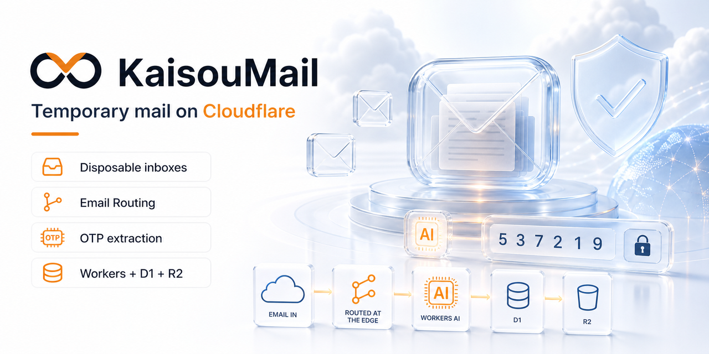
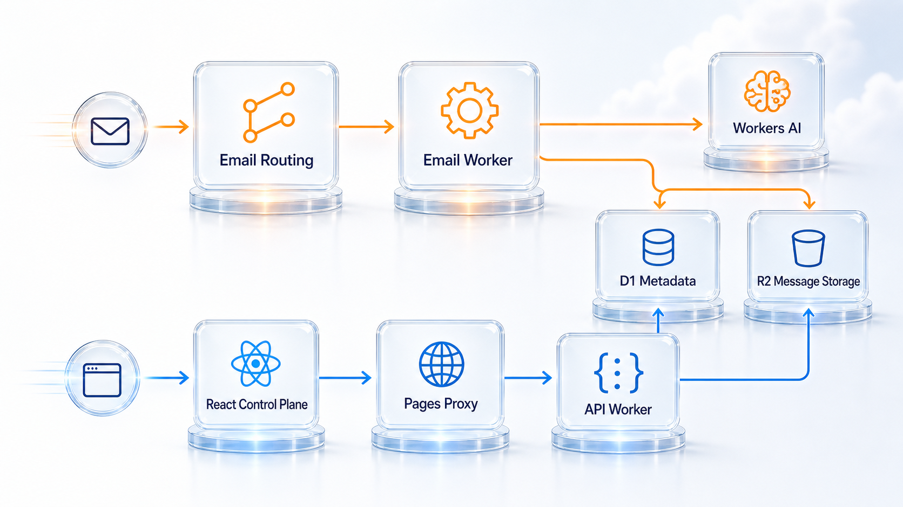
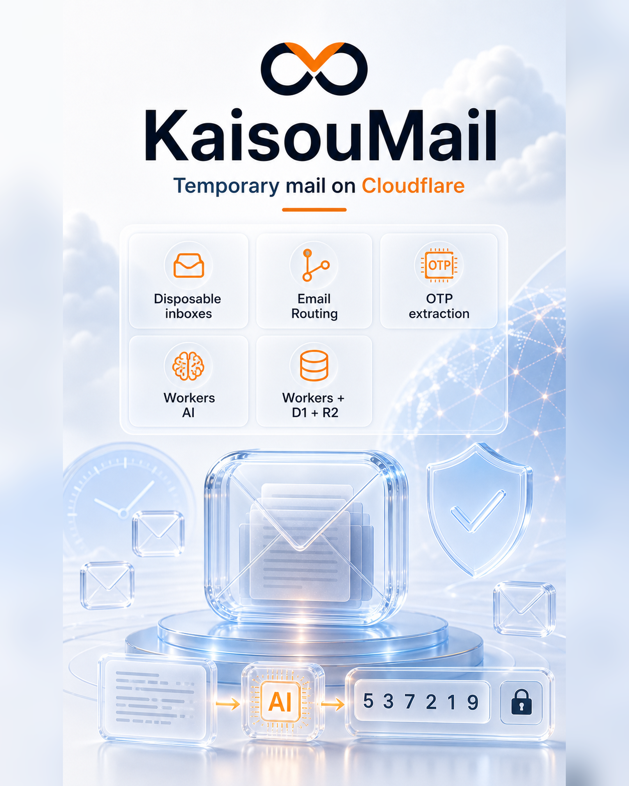

# KaisouMail

[English](./README.md) | [简体中文](./README.zh-CN.md)

[](https://github.com/IvanLi-CN/KaisouMail/actions/workflows/ci-main.yml)
[](https://github.com/IvanLi-CN/KaisouMail/actions/workflows/ci-pr.yml)
[](https://github.com/IvanLi-CN/KaisouMail/actions/workflows/docs-pages.yml)
[](https://developers.cloudflare.com/workers/wrangler/)
[](https://react.dev/)
[](https://hono.dev/)
[](https://vite.dev/)
[](https://tailwindcss.com/)
[](https://bun.sh/)
[](https://github.com/IvanLi-CN/KaisouMail/releases/latest)
[](./LICENSE)

Cloudflare 自托管临时邮箱平台。KaisouMail 提供一个 Cloudflare 原生控制面，用来管理一次性邮箱、域名接入、邮件存储和验证码提取。

<picture>
  <source media="(prefers-color-scheme: dark)" srcset="./apps/web/brand/generated/social/github-social-preview.png">
  
</picture>

## 从这里开始

- 看文档站：[KaisouMail Docs](https://ivanli-cn.github.io/KaisouMail/zh/)
- 部署你自己的实例：[部署与环境变量](https://ivanli-cn.github.io/KaisouMail/zh/deployment-environment)

## 你可以做什么

- 在多个 Cloudflare 域名上管理一次性邮箱。
- 将原始邮件存入 R2，把结构化消息元数据存入 D1。
- 通过 Cloudflare Pages 和 Workers 运行同源的 React 控制面。
- 从 Cloudflare 域名目录接入域名，或直接在 `/domains` 里绑定新的 apex 根域名。
- 验证码提取先走确定性规则，遇到歧义消息时再回退到 Workers AI。
- 通过公开文档、Storybook 预览和 GitHub 流程维持可操作的自托管工作流。

## Demo 快速开始

下面的命令会以 mock data 启动 React 控制面，不需要 Worker、Cloudflare 账户或邮箱域名。

```bash
bun install
bun run version:write
VITE_DEMO_MODE=true bun run --cwd apps/web dev
```

完整的本地双服务、Cloudflare token 配置和生产部署步骤，请看后面的文档入口。

## 架构

<picture>
  <source media="(prefers-color-scheme: dark)" srcset="./docs/readme-assets/kaisoumail-architecture.png">
  
</picture>

- 入站邮件先进入 Email Routing，再流向 Email Worker。
- Email Worker 会把元数据写入 D1 Metadata，把邮件正文写入 R2 Message Storage；当验证码提取存在歧义时，还可以调用 Workers AI。
- 运维侧通过同源 Pages Proxy 使用 React Control Plane。
- Pages Proxy 会把 `/api` 请求转发给 API Worker，由它读写同一份基于 D1/R2 的项目状态。

## 文档与部署

- [快速开始](https://ivanli-cn.github.io/KaisouMail/zh/quick-start)
- [部署与环境变量](https://ivanli-cn.github.io/KaisouMail/zh/deployment-environment)
- [Cloudflare Token 权限](https://ivanli-cn.github.io/KaisouMail/zh/cloudflare-token-permissions)
- [域名接入总览](https://ivanli-cn.github.io/KaisouMail/zh/domain-onboarding)
- [API 参考](https://ivanli-cn.github.io/KaisouMail/zh/api-reference)
- [Storybook 预览](https://ivanli-cn.github.io/KaisouMail/zh/storybook.html)

## 海报

<picture>
  <source media="(prefers-color-scheme: dark)" srcset="./apps/web/brand/generated/social/poster-4x5.png">
  
</picture>

## 贡献

请看 [CONTRIBUTING.md](./CONTRIBUTING.md)。

- 小修复和文档更新可以直接提 Pull Request。
- 较大的功能、架构调整或 breaking change，请先开 Issue 再推进。

## 安全

请看 [SECURITY.md](./SECURITY.md)。漏洞请通过 [GitHub Security Advisories](https://github.com/IvanLi-CN/KaisouMail/security/advisories/new) 私密提交。

## 许可证

[MIT](./LICENSE)
