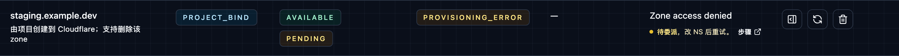

# Bind a new domain directly from the project

Use this guide when **you want to enter a root domain in KaisouMail `/domains` and let the project create the Cloudflare full zone on your behalf.**

This is the flow we are using right now. Compared with “manually add the zone in Cloudflare and enable it in the project later”, it removes one manual handoff but requires more complete runtime permissions and configuration.

## Prepare the feature before first use {#feature-enablement}

### 1. Enable runtime domain management

The API Worker runtime must have:

- `EMAIL_ROUTING_MANAGEMENT_ENABLED=true`
- `CLOUDFLARE_RUNTIME_API_TOKEN` (or the shared `CLOUDFLARE_API_TOKEN`)
- `EMAIL_WORKER_NAME`

Where:

- `EMAIL_ROUTING_MANAGEMENT_ENABLED=true` allows the project to read and mutate Cloudflare domain and Email Routing state
- `EMAIL_WORKER_NAME` determines which Worker future mailbox routing rules target

### 2. Configure the Cloudflare token and scope

Project-direct binding adds one extra step compared with enabling an existing zone: **creating the zone**.

Use the full runtime minimum in [Cloudflare Token Permissions](/cloudflare-token-permissions), and make sure the token scope covers the intended Cloudflare account and zone set.

### 3. Configure `CLOUDFLARE_ACCOUNT_ID`

Direct bind also requires the GitHub repository secret:

- `CLOUDFLARE_ACCOUNT_ID`

The deploy workflow injects it into the API Worker runtime. Without it, the project may have a valid token but still not know which Cloudflare account should own the new zone.

### 4. Verify the entry point is open after deploy

After deploy, confirm:

1. `GET /api/meta` returns `cloudflareDomainLifecycleEnabled=true`
2. `GET /api/meta` returns `cloudflareDomainBindingEnabled=true`
3. `/domains` shows the **Bind new domain** form

If the second value is still `false`, check whether `CLOUDFLARE_ACCOUNT_ID` actually reached Worker runtime instead of existing only in the GitHub Actions job environment.

## Use the feature to bind a new domain {#bind-domain-from-project}

### Step 1: enter the root domain in `/domains`

Open `/domains` in the control plane and locate the **Bind new domain** card:

### Step 2: submit the bind request

After you click **Bind to Cloudflare**, the project calls `POST /api/domains/bind` and then performs:

- Cloudflare `POST /zones`
- Cloudflare `GET /zones/:zone_id`
- Cloudflare `POST /zones/:zone_id/email/routing/enable`

### Step 3: if the page does not go straight to `active`, update nameservers at the registrar first

You usually land in one of these states:

- **`active`**: delegation is already satisfied and the domain can be used for new mailboxes immediately.
- **`provisioning_error` / `pending`**: the zone already exists, but activation is not finished yet. At this point you must update nameservers at the domain registrar before doing anything else.

When the domain is retained in `provisioning_error`, the row stays visible in the domain catalog like this:

At that point, click the **details icon** in the action column for the same row and read the zone plus the Cloudflare-assigned nameservers from the dialog:

Then copy the nameservers from that dialog into your registrar exactly as shown.

> In other words: **the project creates the zone, but it does not update registrar NS records for you. That step is always manual.**

### Step 4: wait for zone activation, then return to `/domains` and retry

After updating nameservers:

1. wait until the zone changes from `pending` to `active` in Cloudflare
2. return to `/domains`
3. click **Retry** for that row
4. confirm the project status becomes `active`

If nameserver delegation is still incomplete, repeatedly clicking **Retry** usually will not help.

## Use the domain after binding {#use-bound-domain}

Once the domain becomes `active`:

- the Web mailbox form can select it directly
- `POST /api/mailboxes` and `POST /api/mailboxes/ensure` can target it with `rootDomain`
- if mailbox creation omits `rootDomain`, the server randomly selects from all `active` domains
- `GET /api/meta` includes it in the current active root-domain list

If you temporarily do not want new mailboxes to land on that domain, disable it in `/domains`. Disable stops new allocations, but it does not automatically delete historical routing rules.

## Troubleshooting {#troubleshooting}

Recommended order: **check permissions and runtime config first, then inspect zone activation state, then inspect Email Routing write permissions.**

### Missing `com.cloudflare.api.account.zone.create` permission {#missing-zone-create-permission}

Typical message:

- `Requires permission "com.cloudflare.api.account.zone.create" to create zones for the selected account`

In the UI, it usually appears as a short inline prompt like this:

This means the runtime token cannot create a new Cloudflare zone, so the bind flow fails on the first Cloudflare call.

Fix steps:

1. verify the expected token is present in Worker runtime
2. verify the token belongs to the intended Cloudflare account
3. add the required zone-management permissions described in [Cloudflare Token Permissions](/cloudflare-token-permissions)
4. redeploy the Worker
5. retry from `/domains`

### Missing Cloudflare permissions required for the bind flow {#missing-zone-binding-permission}

Typical messages:

- `permission denied`
- `forbidden`
- `unauthorized`
- `Requires permission ...`

If the failure is permission-related but not explicitly `zone.create`, the token usually lacks one of the required capabilities in the bind path, such as:

- creating zones
- reading zones
- validating zone access
- enabling Email Routing

Fix steps:

1. compare the runtime token with the minimum set in [Cloudflare Token Permissions](/cloudflare-token-permissions)
2. confirm the token scope covers the intended Cloudflare account and zone
3. redeploy and retry binding

### Missing `CLOUDFLARE_ACCOUNT_ID` {#missing-cloudflare-account-id}

Typical message:

- `Cloudflare domain binding requires CLOUDFLARE_ACCOUNT_ID to be configured`

This is not a token-permission issue. Runtime is missing the account id, so the Worker does not know where the new zone should be created.

Fix steps:

1. add `CLOUDFLARE_ACCOUNT_ID` to repository secrets
2. confirm the deploy workflow injects it into API Worker runtime
3. redeploy
4. confirm `GET /api/meta` returns `cloudflareDomainBindingEnabled=true`
5. retry from `/domains`

### The zone is still `pending` or nameservers are not delegated yet {#zone-pending-or-nameserver-not-delegated}

Typical messages:

- `Zone is pending activation`
- or any message mentioning `pending`, `activation`, `nameserver`, or `delegated`

This means Cloudflare accepted the zone creation request, but nameserver delegation is not complete yet, so Email Routing cannot be enabled.

In the UI, this usually appears as a retained row with `provisioning_error`, plus a **details icon** and **Retry** in the action column:

This is the most common recoverable failure in the project-direct flow:

- the zone stays in the project
- the local record usually shows `provisioning_error`
- once delegation is complete, you can click **Retry** in `/domains`

Fix steps:

1. check whether the zone is still `pending` in Cloudflare
2. click the **details icon** for that row and update registrar nameservers to the exact Cloudflare values shown in the dialog
3. wait until the zone becomes `active`
4. return to `/domains` and click **Retry**

### Missing Email Routing runtime config {#email-routing-runtime-config-missing}

Typical messages:

- `Email Routing management is enabled but EMAIL_WORKER_NAME is not configured`
- `Email Routing management is enabled but CLOUDFLARE_RUNTIME_API_TOKEN or CLOUDFLARE_API_TOKEN is not configured`

This is not a Cloudflare ACL problem. Worker runtime is missing configuration required by the bind flow.

Fix steps:

1. verify runtime injects:
   - `CLOUDFLARE_RUNTIME_API_TOKEN` or `CLOUDFLARE_API_TOKEN`
   - `EMAIL_WORKER_NAME`
2. confirm the deploy workflow passes those values into the API Worker
3. redeploy the Worker
4. retry from `/domains`

### Email Routing enablement authentication or permission failure {#email-routing-auth-or-permission-failure}

Typical messages:

- `Authentication error`
- the zone can be created or read, but Email Routing enablement fails

This usually means the token:

- can access the zone but cannot edit zone settings
- or can access the zone but cannot write Email Routing rules
- or does not scope over the target zone

Fix steps:

1. confirm the token includes:
   - `Zone: Zone: Edit`
   - `Zone: Email Routing Rules: Edit`
   - `Zone: Zone Settings: Edit`
2. confirm the token scope covers the target zone
3. if it still fails, inspect the exact Cloudflare response in Worker logs

### Still cannot identify the failure {#generic-bind-failure}

If the error does not fit the categories above, keep checking in this order:

1. read the original control-plane error kept in the UI
2. inspect the Cloudflare API response in Worker logs
3. confirm token, `CLOUDFLARE_ACCOUNT_ID`, and `EMAIL_WORKER_NAME` are all configured
4. confirm the target domain does not already conflict with another existing zone
5. confirm you are operating in the intended Cloudflare account

## Related reading

- [Manually bind the domain in Cloudflare and enable it in KaisouMail](/domain-catalog-enablement)
- [Cloudflare Token Permissions](/cloudflare-token-permissions)
- [Deployment & Environment](/deployment-environment)
