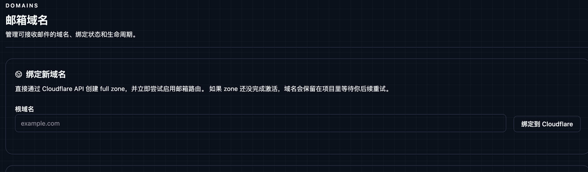
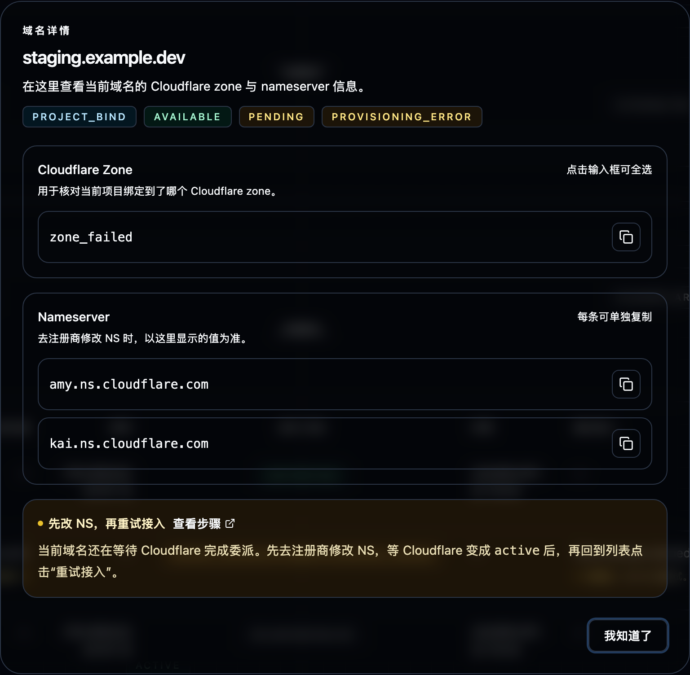
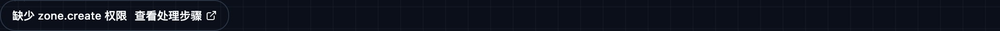

# 在项目中直接绑定新域名

这份文档适用于：**你希望直接在 KaisouMail 的 `/domains` 页面输入根域名，由项目代表你去 Cloudflare 创建 full zone，并继续完成接入。**

这是我们当前正在使用的方案。它和“先在 Cloudflare 里手动绑定，再回到项目启用”相比，少了一次手工切换，但要求运行时权限和配置更完整。

## 启用本功能前的准备 {#feature-enablement}

### 1. 打开运行时域名管理能力

API Worker 运行时必须启用：

- `EMAIL_ROUTING_MANAGEMENT_ENABLED=true`
- `CLOUDFLARE_RUNTIME_API_TOKEN`（或共享的 `CLOUDFLARE_API_TOKEN`）
- `EMAIL_WORKER_NAME`

其中：

- `EMAIL_ROUTING_MANAGEMENT_ENABLED=true` 决定项目能否读写 Cloudflare 域名与 Email Routing
- `EMAIL_WORKER_NAME` 决定后续新邮箱 routing rule 指向哪个 Worker
- 同一组运行时配置也会被域名级 Catch All 开关复用；**不需要新增 secret 名**

### 2. 配好 Cloudflare token 和 scope

直接绑定比“只启用已有 zone”多一步 **创建 zone**，所以 runtime token 除了读取与启用 Email Routing，还必须能直接创建 zone。

推荐直接按 [Cloudflare Token 权限](/zh/cloudflare-token-permissions) 中 runtime token 最小权限表一次性配齐，并确保 scope 覆盖目标 Cloudflare account / zone。

### 3. 配置 `CLOUDFLARE_ACCOUNT_ID`

除了 token 之外，项目直绑还要求 GitHub repository secret 中存在：

- `CLOUDFLARE_ACCOUNT_ID`

deploy workflow 会把它注入 API Worker 运行时。少了这个值，项目即使有 token，也不知道应该在哪个 Cloudflare account 下创建 zone。

### 4. 部署后确认入口已经打开

部署完成后，先确认：

1. `GET /api/meta` 返回 `cloudflareDomainLifecycleEnabled=true`
2. `GET /api/meta` 返回 `cloudflareDomainBindingEnabled=true`
3. `/domains` 页面出现“绑定新域名”表单

如果第二项仍是 `false`，优先检查 `CLOUDFLARE_ACCOUNT_ID` 是否真的进入了 Worker 运行时，而不是只存在于 GitHub Actions job 环境里。

## 使用本功能绑定新域名 {#bind-domain-from-project}

### 步骤 1：在 `/domains` 中填写根域名

打开控制台 `/domains`，在“绑定新域名”卡片里输入根域名：

### 步骤 2：提交绑定请求

点击 **绑定到 Cloudflare** 后，项目会调用 `POST /api/domains/bind`，并依次执行：

- Cloudflare `POST /zones`
- Cloudflare `GET /zones/:zone_id`
- Cloudflare `POST /zones/:zone_id/email/routing/enable`

### 步骤 3：如果页面没有直接变成 `active`，先去注册商修改 NS

提交后通常会出现两种结果：

- **直接进入 `active`**：表示当前域名的委派条件已经满足，可以继续用于新邮箱。
- **先显示 `provisioning_error` / `pending`**：表示 zone 已创建，但还没有完成激活，这时你必须先去域名注册商侧修改 nameserver。

如果页面里出现 `provisioning_error`，会像下面这样保留这条记录：

这时点击该行操作列里的 **详情图标**，在弹窗里查看 zone 和 Cloudflare 分配的 nameserver：

然后把弹窗里的 nameserver 原样抄到你的域名注册商后台。

> 也就是说：**项目负责创建 zone，但不负责替你去注册商改 NS。这个动作必须你自己完成。**

### 步骤 4：等 zone 激活后，再回到 `/domains` 重试接入

把 NS 改好后：

1. 等 Cloudflare 侧 zone 从 `pending` 变成 `active`
2. 回到 `/domains`
3. 对这条域名点击 **重试接入**
4. 确认项目状态变成 `active`

如果你没有先完成 NS 委派，就反复点“重试接入”，通常不会成功。

## 绑定完成后如何使用 {#use-bound-domain}

域名进入 `active` 后：

- Web 控制台新建邮箱时可以直接选它
- `POST /api/mailboxes` / `POST /api/mailboxes/ensure` 可以显式传 `rootDomain`
- 如果创建邮箱时不传 `rootDomain`，服务端会从所有 `active` 域名里随机选一个
- `GET /api/meta` 会把它放进当前可用根域名列表

如果你在 `/domains` 里额外开启了该域名的 Catch All：

- 未预注册的来信地址也会进入收件 Worker
- 系统会把这些地址自动物化成 `Catch All` 长期邮箱
- 关闭 Catch All 时，项目会把 Cloudflare catch-all 恢复到开启前的旧值

如果你暂时不想继续给新邮箱分配这个域名，可以在 `/domains` 里停用；停用只会阻止新邮箱继续选中它，不会自动删除历史 routing rule。

## 问题排查 {#troubleshooting}

建议排查顺序：**先看权限与配置，再看 zone 状态，最后看 Email Routing 启用阶段的写权限。**

### 缺少 `com.cloudflare.api.account.zone.create` 权限 {#missing-zone-create-permission}

典型提示：

- `Requires permission "com.cloudflare.api.account.zone.create" to create zones for the selected account`

控制台里通常会看到类似下面的短提示：

这表示当前 runtime token 根本不能创建新的 Cloudflare zone，所以绑定流程会在第一步直接失败。

处理步骤：

1. 检查 Worker 运行时是否真的拿到了预期 token
2. 检查 token 是否属于正确的 Cloudflare account
3. 对照 [Cloudflare Token 权限](/zh/cloudflare-token-permissions) 补齐 runtime token 的 zone 管理权限
4. 重新部署 Worker
5. 回到 `/domains` 重新发起绑定

### 缺少绑定所需 Cloudflare 权限 {#missing-zone-binding-permission}

典型提示：

- `permission denied`
- `forbidden`
- `unauthorized`
- `Requires permission ...`

如果不是明确的 `zone.create`，但仍然是权限类报错，通常说明当前 token 缺少绑定链路中的某个关键能力，例如：

- 创建 zone
- 读取 zone
- 校验 zone 可访问性
- 启用 Email Routing

处理步骤：

1. 对照 [Cloudflare Token 权限](/zh/cloudflare-token-permissions) 检查 runtime token 最小权限集合
2. 确认 token scope 覆盖目标 Cloudflare account 和对应 zone
3. 重新部署后再重试绑定

### 缺少 `CLOUDFLARE_ACCOUNT_ID` {#missing-cloudflare-account-id}

典型提示：

- `Cloudflare domain binding requires CLOUDFLARE_ACCOUNT_ID to be configured`

这不是 token 权限问题，而是运行时缺少 account id，导致 Worker 不知道应该在哪个 Cloudflare account 下创建 zone。

处理步骤：

1. 在 GitHub repository secrets 中补齐 `CLOUDFLARE_ACCOUNT_ID`
2. 确认 deploy workflow 会把它注入 API Worker 运行时
3. 重新部署
4. 用 `GET /api/meta` 确认 `cloudflareDomainBindingEnabled=true`
5. 再回到 `/domains` 重试

### zone 还在 `pending` 或 nameserver 尚未委派 {#zone-pending-or-nameserver-not-delegated}

典型提示：

- `Zone is pending activation`
- 或任何包含 `pending`、`activation`、`nameserver`、`delegated` 的提示

这说明 Cloudflare 已经接受了 zone 创建请求，但该域名还没有完成 nameserver 委派，所以 Email Routing 暂时无法启用。

在控制台里，这类域名通常会保留在列表中，并显示 `provisioning_error`，同时在操作列提供 **详情图标** 和“重试接入”：

这是项目直绑里最常见的“可恢复失败”：

- zone 会保留在项目里
- 本地记录通常会显示 `provisioning_error`
- 完成委派后可以直接在 `/domains` 点“重试接入”

处理步骤：

1. 去 Cloudflare 查看 zone 是否仍为 `pending`
2. 点击该行操作列里的 **详情图标**，把弹窗里的 Cloudflare nameserver 改到注册商后台
3. 等 zone 变成 `active`
4. 回到 `/domains` 执行“重试接入”

### 缺少 Email Routing 运行时配置 {#email-routing-runtime-config-missing}

典型提示：

- `Email Routing management is enabled but EMAIL_WORKER_NAME is not configured`
- `Email Routing management is enabled but CLOUDFLARE_RUNTIME_API_TOKEN or CLOUDFLARE_API_TOKEN is not configured`

这不是 Cloudflare ACL 权限不够，而是 Worker 运行时缺少绑定链路需要的配置。

处理步骤：

1. 检查部署环境里是否已经注入：
   - `CLOUDFLARE_RUNTIME_API_TOKEN` 或 `CLOUDFLARE_API_TOKEN`
   - `EMAIL_WORKER_NAME`
2. 确认 deploy workflow 会把这些值传进 API Worker
3. 重新部署 Worker
4. 再回到 `/domains` 重试绑定

### Email Routing 启用阶段鉴权或权限失败 {#email-routing-auth-or-permission-failure}

典型提示：

- `Authentication error`
- zone 可以创建或读取，但启用 Email Routing 时失败

这通常表示当前 token：

- 可以访问 zone，但不能改 zone settings
- 或者可以访问 zone，但不能写 Email Routing rules
- 或者 scope 没有覆盖目标 zone

处理步骤：

1. 检查 token 是否具备：
   - `Zone: Zone: Edit`
   - `Zone: Email Routing Rules: Edit`
   - `Zone: Zone Settings: Edit`
2. 确认 token scope 覆盖目标 zone
3. 若仍失败，再对照 Worker 日志中的 Cloudflare 返回继续排查

### 仍然无法定位问题 {#generic-bind-failure}

如果提示不属于上面的任何一类，继续按这个顺序查：

1. 看控制台保留下来的原始错误
2. 看 Worker 日志里的 Cloudflare API 返回
3. 确认 token、`CLOUDFLARE_ACCOUNT_ID`、`EMAIL_WORKER_NAME` 都已配置
4. 确认目标域名没有和当前账号内已有 zone 冲突
5. 确认你操作的是正确的 Cloudflare account

## 相关阅读

- [手动在 Cloudflare 上绑定并在项目中启用域名](/zh/domain-catalog-enablement)
- [Cloudflare Token 权限](/zh/cloudflare-token-permissions)
- [部署与环境变量](/zh/deployment-environment)
