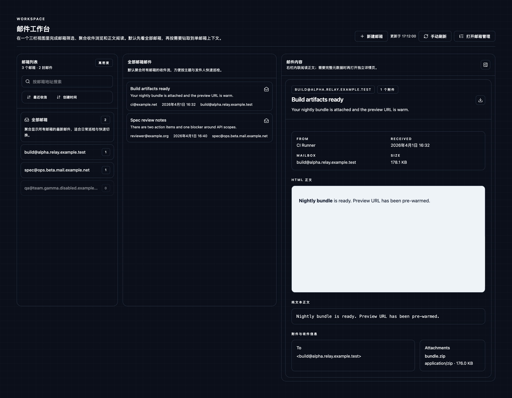
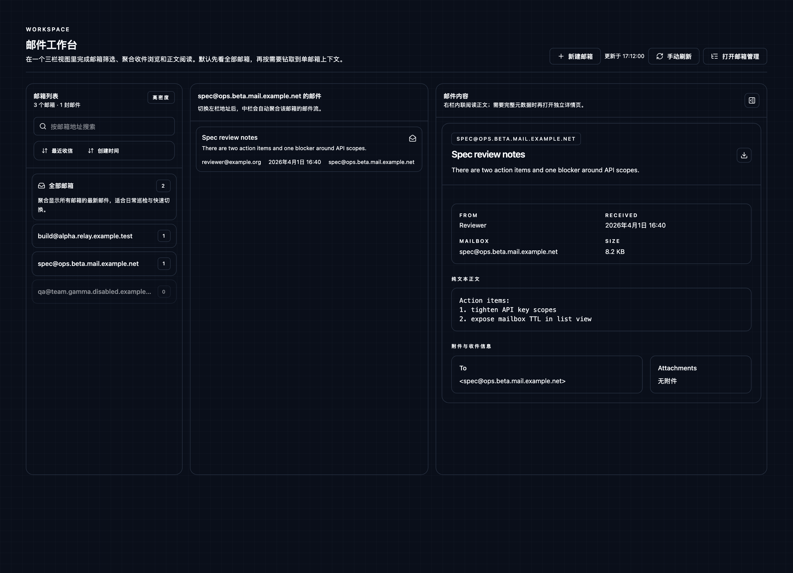
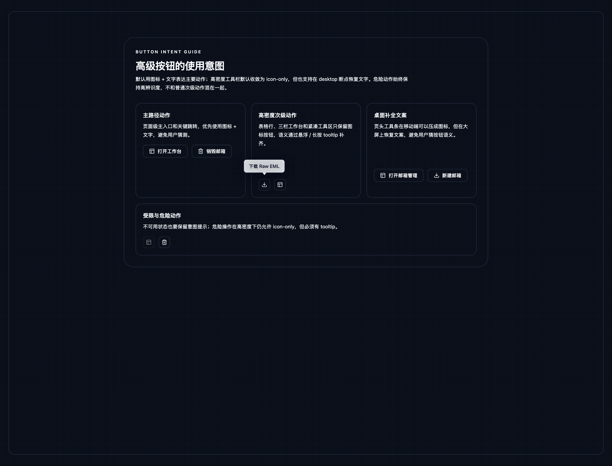
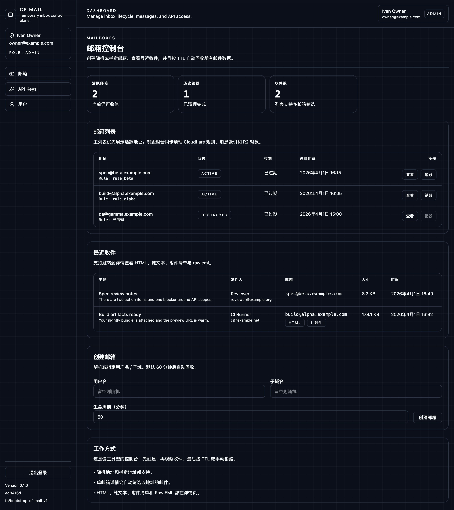
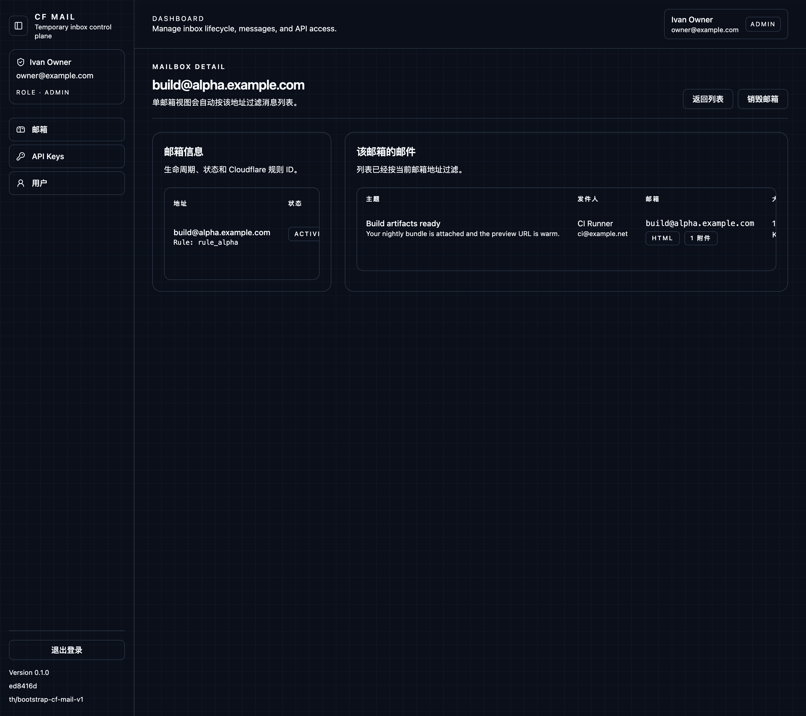
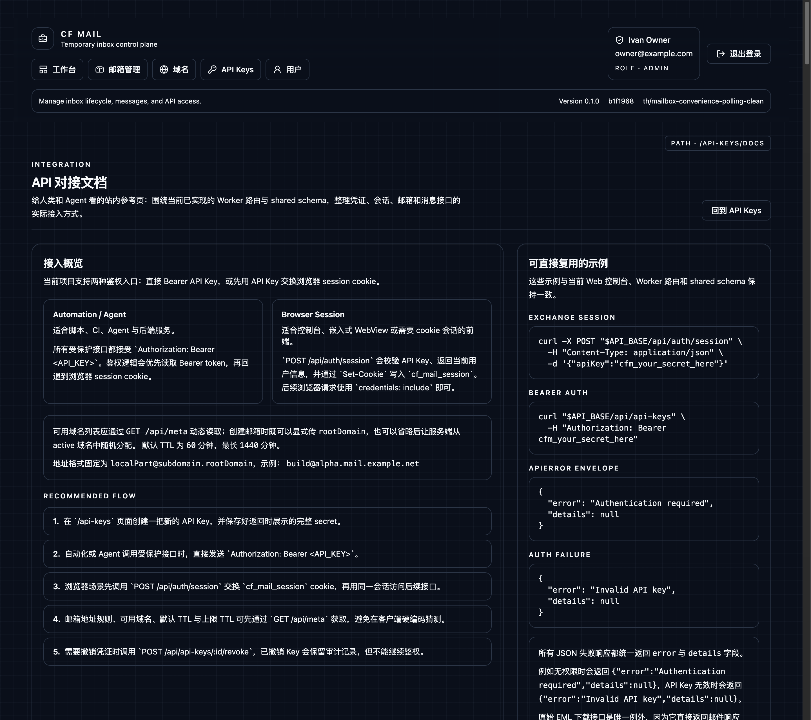

# CF Mail V1 Spec

## Objective

Deliver a Cloudflare-based temporary mailbox control plane with a compact, tool-oriented web console for login, mailbox lifecycle management, message inspection, API key management, and multi-user administration.

## Product Surfaces

### Auth
- `/login`
- API key based sign-in that exchanges credentials for a browser session

### Workspace
- `/workspace`
- Three-pane mail workbench for mailbox filtering, aggregated message browsing, and inline message reading
- URL search params persist mailbox scope, message selection, sort mode, and mailbox search query

### Mailboxes
- `/mailboxes`
- `/mailboxes/:mailboxId`
- Lightweight mailbox inventory and lifecycle management surface
- Message browsing is no longer embedded here; mailbox rows and compatibility routes hand off to the workspace
- Mailbox creation supports both random allocation and idempotent ensure flows for explicit addresses

### Messages
- `/messages/:messageId`
- Inspect parsed message content, HTML preview, plain text, headers, recipients, attachments, and raw EML download
- Legacy-compatible detail route that can reopen the same message inside the workspace
- Message polling supports server-side cursor filtering so repeated verification checks do not rescan the full inbox

### Security
- `/api-keys`
- `/api-keys/docs`
- Create and revoke API keys for automation and browser sign-in
- Protected integration reference for human operators and Agents, covering session exchange, API key lifecycle, mailbox endpoints, and message endpoints

### Users
- `/users`
- Admin-only user management with initial key issuance

## API Contracts

### Error Envelope
- All JSON API failures except raw EML download return `{ error, details }`
- Authentication failure for `POST /api/auth/session` returns `401` with `details: null`
- Unexpected server failures return `500` with `details: null`
- Request validation failures return `400` with field-level or form-level details inside `details`

### Runtime Metadata
- `GET /api/meta`
- Returns the runtime mailbox root domain, default mailbox TTL, minimum TTL, maximum TTL, and address formatting rules
- Web and automation clients consume this metadata instead of hardcoding domain or TTL assumptions

### Mailboxes
- `GET /api/mailboxes` lists visible mailboxes for the current caller
- `POST /api/mailboxes` creates a mailbox and is primarily used for random allocation or non-idempotent creation
- `POST /api/mailboxes/ensure` accepts either `address` or `localPart + subdomain`
- `POST /api/mailboxes/ensure` returns the caller's existing active mailbox for that address when present, otherwise creates a new mailbox
- `POST /api/mailboxes/ensure` returns `200` when reusing an existing active mailbox and `201` when creating a new mailbox
- `GET /api/mailboxes/resolve?address=...` resolves a visible active mailbox directly without requiring the client to list all mailboxes first
- Active mailbox reuse is owner-scoped; an admin can inspect other users' mailboxes through list/detail routes, but `ensure` does not silently take over another user's active mailbox
- Destroyed mailboxes never satisfy `ensure` or `resolve`
- A destroyed mailbox address can be recreated later by a fresh active mailbox

### Messages
- `GET /api/messages` accepts repeated `mailbox` query params to filter by mailbox address
- `GET /api/messages` also accepts `after` and `since` ISO datetime filters over `receivedAt`
- When both `after` and `since` are present, the effective lower bound is the later timestamp
- Cursor filtering uses strict `receivedAt > cursor` semantics

### Address Rules
- Mailbox addresses follow `localPart@subdomain.rootDomain`
- `localPart` uses the shared mailbox local-part validation pattern
- `subdomain` supports multi-level labels such as `alpha` and `ops.alpha`
- Mailbox creation UI presents the runtime root domain and TTL constraints supplied by `/api/meta`

## Data Rules

### Mailbox Lifecycle
- Mailboxes transition through active, destroying, and destroyed states
- Only non-destroyed mailboxes participate in address uniqueness checks
- Destroyed mailbox rows remain visible for history and compact lifecycle display, but do not block future reuse of the same address

## UI Direction

- Dark, minimal, utility-first control plane
- Dense information layout optimized for repeated operational tasks
- Sticky top navigation with clear active state, account context, logout, and skip-to-content affordance
- Desktop-first three-pane workbench for mailbox list, message list, and inline message content
- Workspace mailbox rail supports all-mailbox aggregation, mailbox search, and sorting by recent receive time or create time
- Mailbox management surface is intentionally list-first and minimal; email reading flows jump back into the workspace
- Buttons, badges, and similar compact UI labels must stay on a single line
- Reusable advanced action button primitive: icon + text by default, but secondary actions collapse to icon-only in dense layouts
- Icon-only actions use a mature third-party tooltip with long-press / hover reveal and collision-aware floating placement
- Mailbox presentation removes textual lifecycle badges; the workspace rail uses right-aligned numeric badges while mailbox tables show unread / total counts
- Mailbox rail rows stay single-line and navigation-focused; verbose lifecycle metadata is removed from the dense workspace list
- Destroyed mailboxes collapse to a muted single-line row in dense lists to avoid wasting vertical space
- Table-first detail and management pages remain available as compatibility surfaces
- Cool gray embedded HTML mail preview surface to reduce glare while preserving message fidelity

## Visual Evidence

Evidence is persisted with this spec and refreshed whenever the rendered control-plane surfaces change.

### App Shell

### Workspace

### UI Primitives

### Mailboxes

### Mailbox Detail

### API Key Management

### Integration Reference

